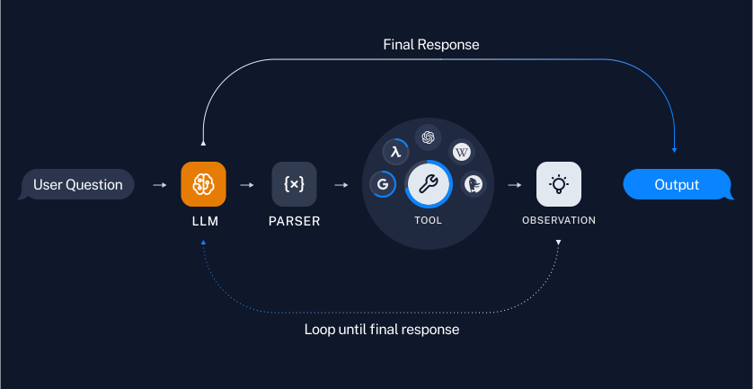

# 如何在链中使用工具

在本指南中，我们将介绍创建调用工具的链和代理的基本方法。工具可以是任何东西——API、函数、数据库等。工具使我们能够扩展模型的能力，不仅仅是输出文本/消息。将模型与工具结合使用的关键在于正确提示模型并解析其响应，以便它选择正确的工具并为其提供正确的输入。

## 设置

我们需要安装以下软件包以进行本指南：

```python
%pip install --upgrade --quiet langchain
```

如果您希望在 [LangSmith](https://docs.smith.langchain.com/) 中跟踪您的运行，请取消注释并设置以下环境变量：

```python
import getpass
import os

# os.environ["LANGCHAIN_TRACING_V2"] = "true"
# os.environ["LANGCHAIN_API_KEY"] = getpass.getpass()
```

## 创建一个工具

首先，我们需要创建一个可以调用的工具。对于这个例子，我们将从一个函数创建一个自定义工具。有关创建自定义工具的更多信息，请参见 [本指南](/docs/how_to/custom_tools)。

```python
from langchain_core.tools import tool


@tool
def multiply(first_int: int, second_int: int) -> int:
    """Multiply two integers together."""
    return first_int * second_int
```


```python
print(multiply.name)
print(multiply.description)
print(multiply.args)
```
```output
multiply
multiply(first_int: int, second_int: int) -> int - Multiply two integers together.
{'first_int': {'title': 'First Int', 'type': 'integer'}, 'second_int': {'title': 'Second Int', 'type': 'integer'}}
```

```python
multiply.invoke({"first_int": 4, "second_int": 5})
```


```output
20
```

## 链

如果我们知道只需要固定次数地使用某个工具，我们可以为此创建一个链。让我们创建一个简单的链，仅仅是乘以用户指定的数字。


### 工具/函数调用
使用工具与 LLM 交互的最可靠方法之一是使用工具调用 APIs（有时也称为函数调用）。这仅适用于明确支持工具调用的模型。您可以在 [这里](https://docs/integrations/chat/) 查看哪些模型支持工具调用，并在 [本指南](https://docs/how_to/function_calling) 中了解如何使用工具调用。

首先，我们将定义我们的模型和工具。我们将从一个工具 `multiply` 开始。

import ChatModelTabs from "@theme/ChatModelTabs";

<ChatModelTabs customVarName="llm"/>

我们将使用 `bind_tools` 将工具的定义作为每次调用模型的一部分传递，以便模型在适当的时候可以调用该工具：

```python
llm_with_tools = llm.bind_tools([multiply])
```

当模型调用该工具时，这将显示在输出的 `AIMessage.tool_calls` 属性中：

```python
msg = llm_with_tools.invoke("whats 5 times forty two")
msg.tool_calls
```


```output
[{'name': 'multiply',
  'args': {'first_int': 5, 'second_int': 42},
  'id': 'call_cCP9oA3tRz7HDrjFn1FdmDaG'}]
```


查看 [LangSmith 跟踪信息](https://smith.langchain.com/public/81ff0cbd-e05b-4720-bf61-2c9807edb708/r)。

### 调用工具

太好了！我们能够生成工具调用。但是如果我们想实际调用工具呢？为此，我们需要将生成的工具参数传递给我们的工具。作为一个简单的例子，我们将提取第一个 tool_call 的参数：

```python
from operator import itemgetter

chain = llm_with_tools | (lambda x: x.tool_calls[0]["args"]) | multiply
chain.invoke("What's four times 23")
```

```output
92
```

请查看 [LangSmith 追踪这里](https://smith.langchain.com/public/16bbabb9-fc9b-41e5-a33d-487c42df4f85/r)。

## 代理

当我们知道任何用户输入所需的工具使用的特定顺序时，链非常适合。但对于某些用例，我们使用工具的次数取决于输入。在这些情况下，我们希望让模型自己决定使用工具的次数和顺序。[代理](/docs/tutorials/agents)可以让我们做到这一点。

LangChain 提供了许多内置代理，这些代理针对不同的用例进行了优化。可以在这里阅读所有[代理类型](/docs/concepts#agents)。

我们将使用[工具调用代理](https://api.python.langchain.com/en/latest/agents/langchain.agents.tool_calling_agent.base.create_tool_calling_agent.html)，这通常是最可靠的类型，也是大多数用例推荐的类型。




```python
from langchain import hub
from langchain.agents import AgentExecutor, create_tool_calling_agent
```


```python
# Get the prompt to use - can be replaced with any prompt that includes variables "agent_scratchpad" and "input"!
prompt = hub.pull("hwchase17/openai-tools-agent")
prompt.pretty_print()
```
```output
================================ 系统消息 ================================

你是一个有帮助的助手

============================= 消息占位符 =============================

{chat_history}

================================ 人类消息 =================================

{input}

============================= 消息占位符 =============================

{agent_scratchpad}
```
代理也很棒，因为它们使使用多个工具变得简单。


```python
@tool
def add(first_int: int, second_int: int) -> int:
    "将两个整数相加。"
    return first_int + second_int


@tool
def exponentiate(base: int, exponent: int) -> int:
    "将底数提升到指数的幂。"
    return base**exponent


tools = [multiply, add, exponentiate]
```


```python
# 构建工具调用代理
agent = create_tool_calling_agent(llm, tools, prompt)
```


```python
# 通过传入代理和工具创建代理执行器
agent_executor = AgentExecutor(agent=agent, tools=tools, verbose=True)
```

使用代理，我们可以提出需要任意多次使用工具的问题：


```python
agent_executor.invoke(
    {
        "input": "将 3 提升到五次方，并将其乘以 12 和 3 的和，然后平方整个结果"
    }
)
```
```output


> 进入新的 AgentExecutor 链...

调用: `exponentiate`，参数为 `{'base': 3, 'exponent': 5}`


243
调用: `add`，参数为 `{'first_int': 12, 'second_int': 3}`


15
调用: `multiply`，参数为 `{'first_int': 243, 'second_int': 15}`


3645
调用: `exponentiate`，参数为 `{'base': 405, 'exponent': 2}`


13286025将 3 提升到五次方的结果是 243。 

12 和 3 的和是 15。 

将 243 乘以 15 得到 3645。 

最后，3645 的平方是 13286025。

> 完成链。
```


```output
{'input': '将 3 提升到五次方，并将其乘以 12 和 3 的和，然后平方整个结果',
 'output': '将 3 提升到五次方的结果是 243。 \n\n12 和 3 的和是 15。 \n\n将 243 乘以 15 得到 3645。 \n\n最后，3645 的平方是 13286025。'}
```


查看 [LangSmith 跟踪](https://smith.langchain.com/public/eeeb27a4-a2f8-4f06-a3af-9c983f76146c/r)。