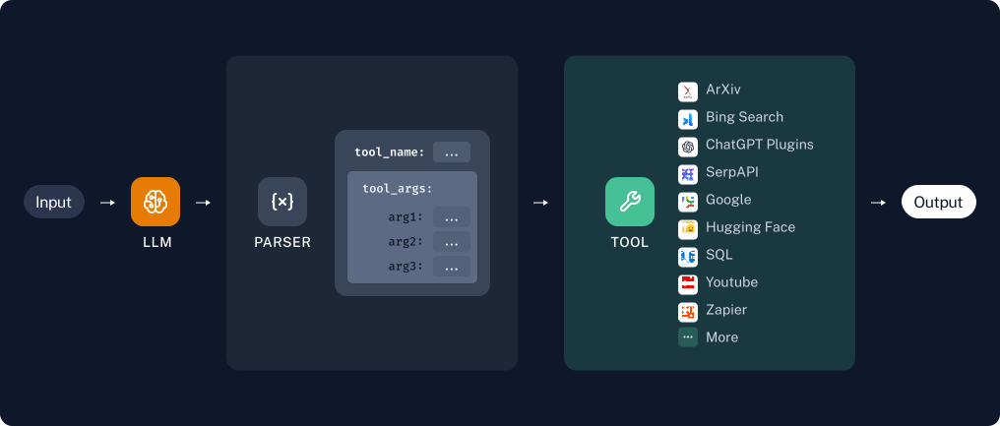

# 如何为 LLM 和聊天模型添加临时工具调用能力

:::caution

某些模型已经针对工具调用进行了微调，并提供了专用的 API 进行工具调用。通常，这些模型在工具调用方面优于未微调的模型，推荐用于需要工具调用的用例。有关更多信息，请参见 [如何使用聊天模型调用工具](/docs/how_to/tool_calling) 指南。

:::

:::info 前提条件

本指南假设您熟悉以下概念：

- [LangChain 工具](/docs/concepts/#tools)
- [函数/工具调用](https://python.langchain.com/v0.2/docs/concepts/#functiontool-calling)
- [聊天模型](/docs/concepts/#chat-models)
- [LLMs](/docs/concepts/#llms)

:::

在本指南中，我们将看到如何为聊天模型添加 **临时** 工具调用支持。这是一种替代方法，用于调用不原生支持 [工具调用](/docs/how_to/tool_calling) 的模型。

我们将通过简单地编写一个提示来实现这一点，以使模型调用适当的工具。以下是逻辑的图示：



## 设置

我们需要安装以下软件包：

```python
%pip install --upgrade --quiet langchain langchain-community
```

如果您想使用 LangSmith，请取消下面的注释：

```python
import getpass
import os
# os.environ["LANGCHAIN_TRACING_V2"] = "true"
# os.environ["LANGCHAIN_API_KEY"] = getpass.getpass()
```

您可以选择本指南中提供的任何模型。请记住，这些模型大多数已经 [支持原生工具调用](/docs/integrations/chat/)，因此在这里使用的提示策略对这些模型没有意义，您应该遵循 [如何使用聊天模型调用工具](/docs/how_to/tool_calling) 指南。

import ChatModelTabs from "@theme/ChatModelTabs";

<ChatModelTabs openaiParams={`model="gpt-4"`} />

为了说明这个想法，我们将通过 Ollama 使用 `phi3`，它 **不** 支持原生工具调用。如果您也想使用 `Ollama`，请遵循 [这些说明](/docs/integrations/chat/ollama/)。

```python
from langchain_community.llms import Ollama

model = Ollama(model="phi3")
```

## 创建工具

首先，让我们创建一个 `add` 和 `multiply` 工具。有关创建自定义工具的更多信息，请参阅 [此指南](/docs/how_to/custom_tools)。

```python
from langchain_core.tools import tool


@tool
def multiply(x: float, y: float) -> float:
    """Multiply two numbers together."""
    return x * y


@tool
def add(x: int, y: int) -> int:
    "Add two numbers."
    return x + y


tools = [multiply, add]

# Let's inspect the tools
for t in tools:
    print("--")
    print(t.name)
    print(t.description)
    print(t.args)
```
```output
--
multiply
Multiply two numbers together.
{'x': {'title': 'X', 'type': 'number'}, 'y': {'title': 'Y', 'type': 'number'}}
--
add
Add two numbers.
{'x': {'title': 'X', 'type': 'integer'}, 'y': {'title': 'Y', 'type': 'integer'}}
```

```python
multiply.invoke({"x": 4, "y": 5})
```


```output
20.0
```

## 创建我们的提示

我们希望编写一个提示，指定模型可以访问的工具、这些工具的参数，以及模型所需的输出格式。在这种情况下，我们将指示它输出一种形式为 `{"name": "...", "arguments": {...}}` 的 JSON 数据块。


```python
from langchain_core.output_parsers import JsonOutputParser
from langchain_core.prompts import ChatPromptTemplate
from langchain_core.tools import render_text_description

rendered_tools = render_text_description(tools)
print(rendered_tools)
```
```output
multiply(x: float, y: float) -> float - 将两个数字相乘。
add(x: int, y: int) -> int - 将两个数字相加。
```

```python
system_prompt = f"""\
您是一个助手，可以访问以下工具集。 
以下是每个工具的名称和描述：

{rendered_tools}

根据用户输入，返回要使用的工具的名称和输入。 
将您的响应作为一个带有 'name' 和 'arguments' 键的 JSON 数据块返回。

`arguments` 应该是一个字典，键对应于参数名称，值对应于请求的值。
"""

prompt = ChatPromptTemplate.from_messages(
    [("system", system_prompt), ("user", "{input}")]
)
```


```python
chain = prompt | model
message = chain.invoke({"input": "3 加 1132 是多少"})

# 让我们看看模型的输出
# 如果模型是一个 LLM（而不是聊天模型），输出将是一个字符串。
if isinstance(message, str):
    print(message)
else:  # 否则它是一个聊天模型
    print(message.content)
```
```output
{
    "name": "add",
    "arguments": {
        "x": 3,
        "y": 1132
    }
}
```

## 添加输出解析器

我们将使用 `JsonOutputParser` 将模型输出解析为 JSON。

```python
from langchain_core.output_parsers import JsonOutputParser

chain = prompt | model | JsonOutputParser()
chain.invoke({"input": "what's thirteen times 4"})
```

```output
{'name': 'multiply', 'arguments': {'x': 13.0, 'y': 4.0}}
```

:::important

🎉 太棒了！ 🎉 我们现在已经指示我们的模型如何 **请求** 调用一个工具。

现在，让我们创建一些逻辑来实际运行这个工具！ 
:::

## 调用工具 🏃

现在模型可以请求调用工具，我们需要编写一个实际调用工具的函数。

该函数将根据名称选择适当的工具，并将模型选择的参数传递给它。

```python
from typing import Any, Dict, Optional, TypedDict

from langchain_core.runnables import RunnableConfig


class ToolCallRequest(TypedDict):
    """一个类型字典，显示传入 invoke_tool 函数的输入。"""

    name: str
    arguments: Dict[str, Any]


def invoke_tool(
    tool_call_request: ToolCallRequest, config: Optional[RunnableConfig] = None
):
    """一个可以用来执行工具调用的函数。

    Args:
        tool_call_request: 包含键 name 和 arguments 的字典。
            name 必须与现有工具的名称匹配。
            arguments 是该工具的参数。
        config: 这是 LangChain 使用的配置信息，包含
            回调、元数据等。请参见 LCEL 文档中的 RunnableConfig。

    Returns:
        请求工具的输出
    """
    tool_name_to_tool = {tool.name: tool for tool in tools}
    name = tool_call_request["name"]
    requested_tool = tool_name_to_tool[name]
    return requested_tool.invoke(tool_call_request["arguments"], config=config)
```

让我们测试一下 🧪！

```python
invoke_tool({"name": "multiply", "arguments": {"x": 3, "y": 5}})
```

```output
15.0
```

## 我们来整合一下

我们将其整合成一个链，创建一个具有加法和乘法功能的计算器。

```python
chain = prompt | model | JsonOutputParser() | invoke_tool
chain.invoke({"input": "what's thirteen times 4.14137281"})
```

```output
53.83784653
```

## 返回工具输入

返回工具输出时，同时返回工具输入也是很有帮助的。我们可以通过 `RunnablePassthrough.assign` 来轻松实现这一点。这将获取传递给 RunnablePassthrough 组件的输入（假设为字典），并在其上添加一个键，同时仍然传递输入中当前的所有内容：

```python
from langchain_core.runnables import RunnablePassthrough

chain = (
    prompt | model | JsonOutputParser() | RunnablePassthrough.assign(output=invoke_tool)
)
chain.invoke({"input": "what's thirteen times 4.14137281"})
```

```output
{'name': 'multiply',
 'arguments': {'x': 13, 'y': 4.14137281},
 'output': 53.83784653}
```

## 接下来是什么？

本指南展示了当模型正确输出所有所需工具信息时的“理想路径”。

实际上，如果您使用更复杂的工具，您将开始遇到模型的错误，尤其是对于那些没有针对工具调用进行微调的模型以及能力较弱的模型。

您需要准备好添加策略以改善模型的输出；例如：

1. 提供少量示例。
2. 添加错误处理（例如，捕获异常并将其反馈给LLM，要求其纠正之前的输出）。