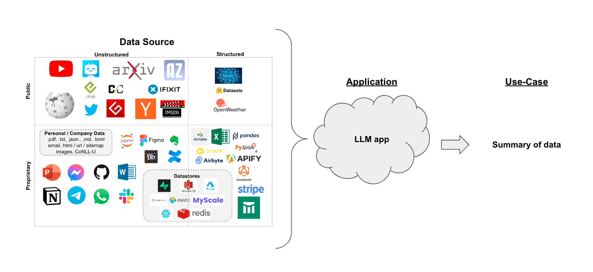

# 文本摘要

假设您有一组文档（PDF、Notion 页面、客户问题等），您想要总结内容。

LLMs 是一个很好的工具，因为它们在理解和综合文本方面非常熟练。

在[检索增强生成](/docs/tutorials/rag)的背景下，文本摘要可以帮助提炼大量检索文档中的信息，为 LLM 提供上下文。

在本指南中，我们将介绍如何使用 LLMs 从多个文档中总结内容。



## 概念

我们将涵盖的概念包括：

- 使用 [language models](/docs/concepts/#chat-models)。

- 使用 [document loaders](/docs/concepts/#document-loaders)，特别是 [WebBaseLoader](https://api.python.langchain.com/en/latest/document_loaders/langchain_community.document_loaders.web_base.WebBaseLoader.html) 从 HTML 网页加载内容。

- 三种总结或组合文档的方法。
  1. [Stuff](/docs/tutorials/summarization#stuff)，它简单地将文档连接成一个提示；
  2. [Map-reduce](/docs/tutorials/summarization#map-reduce)，它将文档拆分成批次，总结这些批次，然后总结这些总结；
  3. [Refine](/docs/tutorials/summarization#refine)，它通过按顺序迭代文档来更新滚动摘要。

这要涵盖的内容相当多！让我们开始吧。

## 设置

### Jupyter Notebook

本指南（以及文档中的大多数其他指南）使用 [Jupyter notebooks](https://jupyter.org/) 并假设读者也使用它。Jupyter notebooks 非常适合学习如何使用 LLM 系统，因为很多时候事情可能会出错（意外输出、API 故障等），在交互式环境中浏览指南是更好地理解它们的好方法。

本教程和其他教程可能最方便在 Jupyter notebook 中运行。有关安装说明，请参见 [这里](https://jupyter.org/install)。

### 安装

要安装 LangChain，请运行：

import Tabs from '@theme/Tabs';
import TabItem from '@theme/TabItem';
import CodeBlock from "@theme/CodeBlock";

<Tabs>
  <TabItem value="pip" label="Pip" default>
    <CodeBlock language="bash">pip install langchain</CodeBlock>
  </TabItem>
  <TabItem value="conda" label="Conda">
    <CodeBlock language="bash">conda install langchain -c conda-forge</CodeBlock>
  </TabItem>
</Tabs>

有关更多详细信息，请参阅我们的 [安装指南](/docs/how_to/installation)。

### LangSmith

您使用 LangChain 构建的许多应用程序将包含多个步骤和多次调用 LLM。  
随着这些应用程序变得越来越复杂，能够检查您的链或代理内部究竟发生了什么变得至关重要。  
实现这一点的最佳方法是使用 [LangSmith](https://smith.langchain.com)。

在您在上述链接注册后，请确保设置您的环境变量以开始记录跟踪：

```shell
export LANGCHAIN_TRACING_V2="true"
export LANGCHAIN_API_KEY="..."
```

或者，如果在笔记本中，您可以通过以下方式设置它们：

```python
import getpass
import os

os.environ["LANGCHAIN_TRACING_V2"] = "true"
os.environ["LANGCHAIN_API_KEY"] = getpass.getpass()
```

## 概述

构建摘要生成器的一个核心问题是如何将文档传递到LLM的上下文窗口中。常见的三种方法是：

1. `Stuff`: 简单地将所有文档“填充”到一个单一的提示中。这是最简单的方法（有关`create_stuff_documents_chain`构造函数的更多信息，请参见[这里](/docs/tutorials/rag#built-in-chains)，该构造函数用于此方法）。

2. `Map-reduce`: 在“映射”步骤中单独总结每个文档，然后将摘要“归约”成最终摘要（有关`MapReduceDocumentsChain`的更多信息，请参见[这里](https://api.python.langchain.com/en/latest/chains/langchain.chains.combine_documents.map_reduce.MapReduceDocumentsChain.html)，该方法使用此方法）。

3. `Refine`: 通过按顺序迭代文档来更新滚动摘要。
   
   


## 快速入门

为了给您一个简单的预览，任一管道都可以被封装在一个单一对象中：`load_summarize_chain`。

假设我们想要总结一篇博客文章。我们可以用几行代码来实现。

首先设置环境变量并安装包：

```python
%pip install --upgrade --quiet  langchain-openai tiktoken chromadb langchain

# 设置环境变量 OPENAI_API_KEY 或从 .env 文件加载
# import dotenv

# dotenv.load_dotenv()
```

我们可以使用 `chain_type="stuff"`，特别是当使用更大的上下文窗口模型时，例如：

* 128k token OpenAI `gpt-4-turbo-2024-04-09` 
* 200k token Anthropic `claude-3-sonnet-20240229`

我们还可以提供 `chain_type="map_reduce"` 或 `chain_type="refine"`。

首先我们加载文档。我们将使用 [WebBaseLoader](https://api.python.langchain.com/en/latest/document_loaders/langchain_community.document_loaders.web_base.WebBaseLoader.html) 来加载一篇博客文章：

```python
import os

os.environ["LANGCHAIN_TRACING_V2"] = "True"
```

```python
from langchain.chains.summarize import load_summarize_chain
from langchain_community.document_loaders import WebBaseLoader
from langchain_openai import ChatOpenAI

loader = WebBaseLoader("https://lilianweng.github.io/posts/2023-06-23-agent/")
docs = loader.load()

llm = ChatOpenAI(temperature=0, model_name="gpt-3.5-turbo-1106")
chain = load_summarize_chain(llm, chain_type="stuff")

result = chain.invoke(docs)

print(result["output_text"])
```
```output
The article discusses the concept of LLM-powered autonomous agents, with a focus on the components of planning, memory, and tool use. It includes case studies and proof-of-concept examples, as well as challenges and references to related research. The author emphasizes the potential of LLMs in creating powerful problem-solving agents, while also highlighting limitations such as finite context length and reliability of natural language interfaces.
```

## 选项 1. Stuff {#stuff}

当我们使用 `load_summarize_chain` 并设置 `chain_type="stuff"` 时，我们将使用 [StuffDocumentsChain](https://api.python.langchain.com/en/latest/chains/langchain.chains.combine_documents.stuff.StuffDocumentsChain.html#langchain.chains.combine_documents.stuff.StuffDocumentsChain)。

该链将接受一个文档列表，将它们全部插入到一个提示中，并将该提示传递给 LLM：

```python
from langchain.chains.combine_documents.stuff import StuffDocumentsChain
from langchain.chains.llm import LLMChain
from langchain_core.prompts import PromptTemplate

# Define prompt
prompt_template = """Write a concise summary of the following:
"{text}"
CONCISE SUMMARY:"""
prompt = PromptTemplate.from_template(prompt_template)

# Define LLM chain
llm = ChatOpenAI(temperature=0, model_name="gpt-3.5-turbo-16k")
llm_chain = LLMChain(llm=llm, prompt=prompt)

# Define StuffDocumentsChain
stuff_chain = StuffDocumentsChain(llm_chain=llm_chain, document_variable_name="text")

docs = loader.load()
print(stuff_chain.invoke(docs)["output_text"])
```
```output
The article discusses the concept of building autonomous agents powered by large language models (LLMs). It explores the components of such agents, including planning, memory, and tool use. The article provides case studies and examples of proof-of-concept demos, highlighting the challenges and limitations of LLM-powered agents. It also includes references to related research papers and projects.
```
很好！我们可以看到使用 `load_summarize_chain` 重现了之前的结果。

### 深入了解

* 您可以轻松自定义提示。
* 您可以轻松尝试不同的 LLM，例如通过 `llm` 参数使用 [Claude](/docs/integrations/chat/anthropic)。

## 选项 2. Map-Reduce {#map-reduce}

让我们来解析一下 map reduce 方法。为此，我们将首先使用 `LLMChain` 将每个文档映射到单独的摘要。然后，我们将使用 `ReduceDocumentsChain` 将这些摘要合并为一个全球摘要。

首先，我们指定用于将每个文档映射到单独摘要的 LLMChain：

```python
from langchain.chains import MapReduceDocumentsChain, ReduceDocumentsChain
from langchain_text_splitters import CharacterTextSplitter

llm = ChatOpenAI(temperature=0)

# Map
map_template = """The following is a set of documents
{docs}
Based on this list of docs, please identify the main themes 
Helpful Answer:"""
map_prompt = PromptTemplate.from_template(map_template)
map_chain = LLMChain(llm=llm, prompt=map_prompt)
```

我们还可以使用 Prompt Hub 来存储和获取提示。

这将与您的 [LangSmith API 密钥](https://docs.smith.langchain.com/) 一起使用。

例如，可以在 [这里](https://smith.langchain.com/hub/rlm/map-prompt) 查看 map 提示。

```python
from langchain import hub

map_prompt = hub.pull("rlm/map-prompt")
map_chain = LLMChain(llm=llm, prompt=map_prompt)
```

`ReduceDocumentsChain` 处理将文档映射结果减少为单个输出。它包装了一个通用的 `CombineDocumentsChain`（如 `StuffDocumentsChain`），但增加了在将文档传递给 `CombineDocumentsChain` 之前，如果它们的累积大小超过 `token_max`，则合并文档的能力。在这个例子中，我们实际上可以重用我们的链来合并我们的文档，同时也合并我们的文档。

因此，如果我们映射文档中的累计令牌数量超过 4000 个令牌，那么我们将递归地将文档以少于 4000 个令牌的批次传递给我们的 `StuffDocumentsChain` 以创建批量摘要。一旦这些批量摘要的累计数量少于 4000 个令牌，我们将最后一次将它们全部传递给 `StuffDocumentsChain` 以创建最终摘要。

```python
# Reduce
reduce_template = """The following is set of summaries:
{docs}
Take these and distill it into a final, consolidated summary of the main themes. 
Helpful Answer:"""
reduce_prompt = PromptTemplate.from_template(reduce_template)
```

```python
# Note we can also get this from the prompt hub, as noted above
reduce_prompt = hub.pull("rlm/reduce-prompt")
```

```python
reduce_prompt
```

```output
ChatPromptTemplate(input_variables=['docs'], metadata={'lc_hub_owner': 'rlm', 'lc_hub_repo': 'map-prompt', 'lc_hub_commit_hash': 'de4fba345f211a462584fc25b7077e69c1ba6cdcf4e21b7ec9abe457ddb16c87'}, messages=[HumanMessagePromptTemplate(prompt=PromptTemplate(input_variables=['docs'], template='The following is a set of documents:\n{docs}\nBased on this list of docs, please identify the main themes \nHelpful Answer:'))])
```

```python
# Run chain
reduce_chain = LLMChain(llm=llm, prompt=reduce_prompt)

# Takes a list of documents, combines them into a single string, and passes this to an LLMChain
combine_documents_chain = StuffDocumentsChain(
    llm_chain=reduce_chain, document_variable_name="docs"
)

# Combines and iteratively reduces the mapped documents
reduce_documents_chain = ReduceDocumentsChain(
    # This is final chain that is called.
    combine_documents_chain=combine_documents_chain,
    # If documents exceed context for `StuffDocumentsChain`
    collapse_documents_chain=combine_documents_chain,
    # The maximum number of tokens to group documents into.
    token_max=4000,
)
```

将我们的 map 和 reduce 链合并为一个：

```python
# Combining documents by mapping a chain over them, then combining results
map_reduce_chain = MapReduceDocumentsChain(
    # Map chain
    llm_chain=map_chain,
    # Reduce chain
    reduce_documents_chain=reduce_documents_chain,
    # The variable name in the llm_chain to put the documents in
    document_variable_name="docs",
    # Return the results of the map steps in the output
    return_intermediate_steps=False,
)

text_splitter = CharacterTextSplitter.from_tiktoken_encoder(
    chunk_size=1000, chunk_overlap=0
)
split_docs = text_splitter.split_documents(docs)
```
```output
Created a chunk of size 1003, which is longer than the specified 1000
```

```python
result = map_reduce_chain.invoke(split_docs)

print(result["output_text"])
```
```output
The main themes identified in the list of documents provided are related to large language models (LLMs), autonomous agents, prompting, steering language models, natural language processing (NLP), the use of tools to augment language models, reinforcement learning, reasoning, acting, self-reflection, and the integration of language models with external knowledge sources.
```
如果我们遵循 [Langsmith Trace](https://smith.langchain.com/public/3a1a6d51-68e5-4805-8d90-78920ce60a51/r)，我们可以看到单个 LLM 摘要，包括总结摘要的 [最终调用](https://smith.langchain.com/public/69482813-f0b7-46b0-a99f-86d56fc9644a/r)。

### 更深入

**定制化**

* 如上所示，您可以定制 LLMs 和提示以用于映射和归约阶段。

**实际用例**

* 请参阅[这篇博客文章](https://blog.langchain.dev/llms-to-improve-documentation/)关于分析用户交互（关于 LangChain 文档的问题）的案例研究！  
* 该博客文章及相关[仓库](https://github.com/mendableai/QA_clustering)还介绍了聚类作为一种总结手段。
* 这为超越 `stuff` 或 `map-reduce` 方法提供了另一种值得考虑的途径。


## 选项 3. 精炼 {#refine}

[RefineDocumentsChain](https://api.python.langchain.com/en/latest/chains/langchain.chains.combine_documents.refine.RefineDocumentsChain.html) 类似于 map-reduce：

> 精炼文档链通过循环处理输入文档并迭代更新其答案来构建响应。对于每个文档，它将所有非文档输入、当前文档和最新的中间答案传递给 LLM 链以获取新的答案。

这可以通过指定 `chain_type="refine"` 轻松运行。

```python
chain = load_summarize_chain(llm, chain_type="refine")
result = chain.invoke(split_docs)

print(result["output_text"])
```
```output
现有的摘要提供了通过代码实现项目架构的详细说明，重点是按照所选语言和框架的最佳实践在不同文件中创建核心类、函数和方法。关于模型、视图和控制器组件的假设也被概述。附加的背景强调了长期规划和任务分解中的挑战，以及 LLM 驱动的自主代理在自然语言接口方面的可靠性问题。这些见解揭示了在代理系统中使用 LLM 的局限性和潜在陷阱，并引用了关于 LLM 驱动的自主代理和相关技术的最新研究。
```
根据 [Langsmith trace](https://smith.langchain.com/public/38017fa7-b190-4635-992c-e8554227a4bb/r)，我们可以看到摘要随着新信息的迭代更新。

也可以提供提示并返回中间步骤。

```python
prompt_template = """写一个简明的摘要，内容如下：
{text}
简明摘要："""
prompt = PromptTemplate.from_template(prompt_template)

refine_template = (
    "你的任务是生成最终摘要\n"
    "我们提供了一个现有的摘要，直到某个点：{existing_answer}\n"
    "我们有机会用下面的一些更多上下文来精炼现有摘要"
    "(仅在需要时)。\n"
    "------------\n"
    "{text}\n"
    "------------\n"
    "根据新上下文，精炼原始摘要为意大利语"
    "如果上下文没有用，返回原始摘要。"
)
refine_prompt = PromptTemplate.from_template(refine_template)
chain = load_summarize_chain(
    llm=llm,
    chain_type="refine",
    question_prompt=prompt,
    refine_prompt=refine_prompt,
    return_intermediate_steps=True,
    input_key="input_documents",
    output_key="output_text",
)
result = chain.invoke({"input_documents": split_docs}, return_only_outputs=True)
```

```python
print(result["output_text"])
```
```output
本文讨论了使用 LLM（大型语言模型）作为核心控制器构建自主代理的概念。它探讨了 LLM 驱动的代理系统的不同组件，包括规划、记忆和工具使用。概念验证演示的例子展示了 LLM 作为通用问题解决者的潜力。像 Chain of Thought、Tree of Thoughts、LLM+P、ReAct 和 Reflexion 等方法使自主代理能够进行规划、自我反思和迭代改进。然而，仍然面临挑战，如有限的上下文能力限制了详细历史信息的包含，以及长期规划和任务分解的困难。此外，LLM 与外部组件（如记忆和工具）之间的自然语言接口的可靠性也不确定，因为 LLM 可能会出现格式错误并表现出反叛行为。尽管如此，AutoGPT 系统被提及作为一个使用 LLM 作为自主代理核心控制器的概念验证示例。本文引用了多个来源，探讨了 LLM 在自主代理领域的具体方法和应用。
```

```python
print("\n\n".join(result["intermediate_steps"][:3]))
```
```output
本文讨论了使用 LLM（大型语言模型）作为核心控制器构建自主代理的概念。文章探讨了 LLM 驱动的代理系统的不同组件，包括规划、记忆和工具使用。它还提供了概念验证演示的例子，并强调了 LLM 作为通用问题解决者的潜力。

Questo articolo discute del concetto di costruire agenti autonomi utilizzando LLM (large language model) come controller principale. L'articolo esplora i diversi componenti di un sistema di agenti alimentato da LLM, inclusa la pianificazione, la memoria e l'uso degli strumenti. Vengono forniti anche esempi di dimostrazioni di proof-of-concept e si evidenzia il potenziale di LLM come risolutore generale di problemi. Inoltre, vengono presentati approcci come Chain of Thought, Tree of Thoughts, LLM+P, ReAct e Reflexion che consentono agli agenti autonomi di pianificare, riflettere su se stessi e migliorare iterativamente.

Questo articolo discute del concetto di costruire agenti autonomi utilizzando LLM (large language model) come controller principale. L'articolo esplora i diversi componenti di un sistema di agenti alimentato da LLM, inclusa la pianificazione, la memoria e l'uso degli strumenti. Vengono forniti anche esempi di dimostrazioni di proof-of-concept e si evidenzia il potenziale di LLM come risolutore generale di problemi. Inoltre, vengono presentati approcci come Chain of Thought, Tree of Thoughts, LLM+P, ReAct e Reflexion che consentono agli agenti autonomi di pianificare, riflettere su se stessi e migliorare iterativamente. Il nuovo contesto riguarda l'approccio Chain of Hindsight (CoH) che permette al modello di migliorare autonomamente i propri output attraverso un processo di apprendimento supervisionato. Viene anche presentato l'approccio Algorithm Distillation (AD) che applica lo stesso concetto alle traiettorie di apprendimento per compiti di reinforcement learning.
```

## 在单个链中拆分和总结
为了方便，我们可以将长文档的文本拆分和总结包装在一个单一的[链](/docs/how_to/sequence)中：

```python
def split_text(text: str):
    return text_splitter.create_documents([text])


summarize_document_chain = split_text | chain
```

## 下一步

我们鼓励您查看 [使用指南](/docs/how_to) 以获取更多详细信息，内容包括：

- 内置的 [文档加载器](/docs/how_to/#document-loaders) 和 [文本拆分器](/docs/how_to/#text-splitters)
- 将各种组合文档链集成到 [RAG 应用程序](/docs/tutorials/rag/)
- 将检索功能纳入 [聊天机器人](/docs/how_to/chatbots_retrieval/)

以及其他概念。